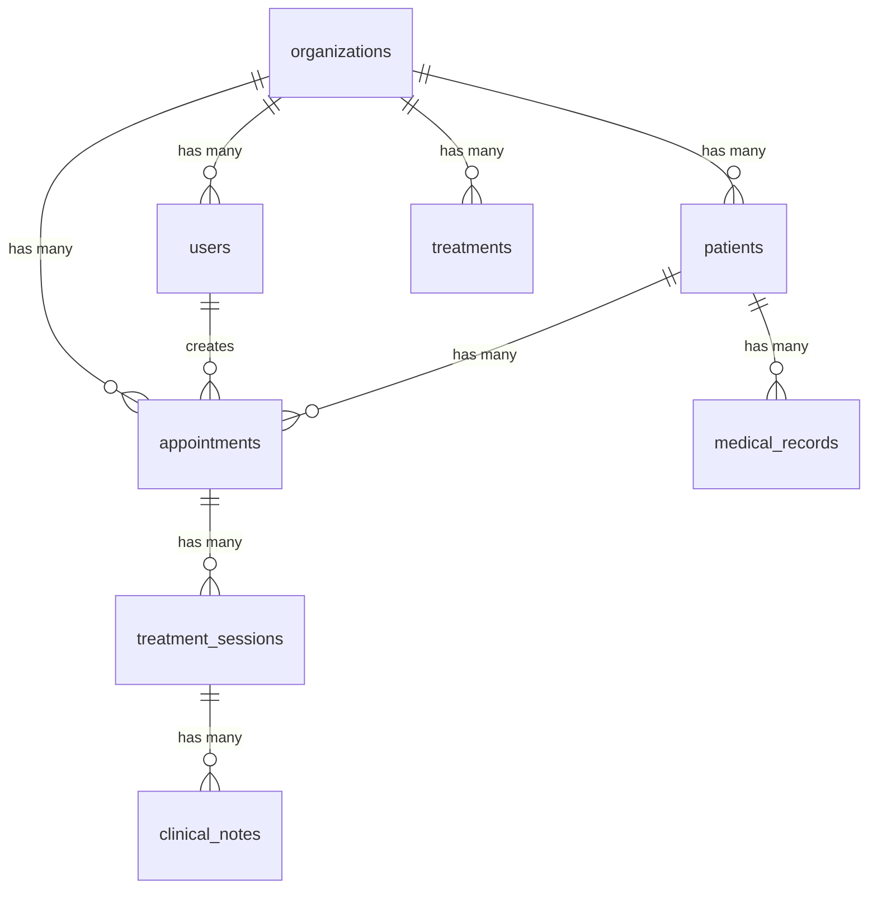

# Multi-Tenant Database Architecture

## Schema Design Strategy

### 1. Row-Level Security (RLS) Pattern

```sql
-- Core tenant isolation
CREATE TABLE organizations (
  id UUID PRIMARY KEY DEFAULT gen_random_uuid(),
  name VARCHAR(255) NOT NULL,
  slug VARCHAR(100) UNIQUE NOT NULL,
  settings JSONB DEFAULT '{}',
  created_at TIMESTAMP WITH TIME ZONE DEFAULT NOW(),
  updated_at TIMESTAMP WITH TIME ZONE DEFAULT NOW()
);

-- Enable RLS on all tenant-specific tables
ALTER TABLE patients ENABLE ROW LEVEL SECURITY;
ALTER TABLE appointments ENABLE ROW LEVEL SECURITY;
ALTER TABLE treatments ENABLE ROW LEVEL SECURITY;

-- RLS Policies Example
CREATE POLICY tenant_isolation ON patients
  FOR ALL TO authenticated
  USING (organization_id = current_setting('app.current_organization_id')::UUID);
```

### 2. Core Entity Relationships



### 3. Better Auth + Drizzle Schema Implementation

Based on Better Auth documentation requirements <mcreference link="https://www.better-auth.com/docs/concepts/database" index="0">0</mcreference>, the complete schema includes core authentication tables and organization plugin tables:

```typescript
// schema/auth.ts - Better Auth Core Tables
import { pgTable, text, timestamp, boolean, uuid, varchar } from 'drizzle-orm/pg-core'

// Core Better Auth Tables
export const user = pgTable('user', {
  id: text('id').primaryKey(),
  name: text('name').notNull(),
  email: text('email').notNull().unique(),
  emailVerified: boolean('emailVerified').notNull().default(false),
  image: text('image'),
  createdAt: timestamp('createdAt').notNull().defaultNow(),
  updatedAt: timestamp('updatedAt').notNull().defaultNow()
})

export const session = pgTable('session', {
  id: text('id').primaryKey(),
  expiresAt: timestamp('expiresAt').notNull(),
  token: text('token').notNull().unique(),
  createdAt: timestamp('createdAt').notNull().defaultNow(),
  updatedAt: timestamp('updatedAt').notNull().defaultNow(),
  ipAddress: text('ipAddress'),
  userAgent: text('userAgent'),
  userId: text('userId')
    .notNull()
    .references(() => user.id, { onDelete: 'cascade' }),
  // Organization plugin additions
  activeOrganizationId: text('activeOrganizationId').references(() => organization.id),
  activeTeamId: text('activeTeamId').references(() => team.id)
})

export const account = pgTable('account', {
  id: text('id').primaryKey(),
  accountId: text('accountId').notNull(),
  providerId: text('providerId').notNull(),
  userId: text('userId')
    .notNull()
    .references(() => user.id, { onDelete: 'cascade' }),
  accessToken: text('accessToken'),
  refreshToken: text('refreshToken'),
  idToken: text('idToken'),
  accessTokenExpiresAt: timestamp('accessTokenExpiresAt'),
  refreshTokenExpiresAt: timestamp('refreshTokenExpiresAt'),
  scope: text('scope'),
  password: text('password'),
  createdAt: timestamp('createdAt').notNull().defaultNow(),
  updatedAt: timestamp('updatedAt').notNull().defaultNow()
})

export const verification = pgTable('verification', {
  id: text('id').primaryKey(),
  identifier: text('identifier').notNull(),
  value: text('value').notNull(),
  expiresAt: timestamp('expiresAt').notNull(),
  createdAt: timestamp('createdAt').notNull().defaultNow(),
  updatedAt: timestamp('updatedAt').notNull().defaultNow()
})

// Organization Plugin Tables
export const organization = pgTable('organization', {
  id: text('id').primaryKey(),
  name: text('name').notNull(),
  slug: text('slug').notNull().unique(),
  logo: text('logo'),
  metadata: text('metadata'), // JSON string for additional data
  createdAt: timestamp('createdAt').notNull().defaultNow(),
  updatedAt: timestamp('updatedAt').notNull().defaultNow()
})

export const member = pgTable('member', {
  id: text('id').primaryKey(),
  organizationId: text('organizationId')
    .notNull()
    .references(() => organization.id, { onDelete: 'cascade' }),
  userId: text('userId')
    .notNull()
    .references(() => user.id, { onDelete: 'cascade' }),
  role: text('role').notNull().default('member'),
  createdAt: timestamp('createdAt').notNull().defaultNow(),
  updatedAt: timestamp('updatedAt').notNull().defaultNow()
})

export const invitation = pgTable('invitation', {
  id: text('id').primaryKey(),
  organizationId: text('organizationId')
    .notNull()
    .references(() => organization.id, { onDelete: 'cascade' }),
  email: text('email').notNull(),
  role: text('role').notNull().default('member'),
  status: text('status').notNull().default('pending'),
  expiresAt: timestamp('expiresAt').notNull(),
  inviterId: text('inviterId')
    .notNull()
    .references(() => user.id),
  teamId: text('teamId').references(() => team.id), // Optional team assignment
  createdAt: timestamp('createdAt').notNull().defaultNow(),
  updatedAt: timestamp('updatedAt').notNull().defaultNow()
})

// Team functionality (optional)
export const team = pgTable('team', {
  id: text('id').primaryKey(),
  name: text('name').notNull(),
  organizationId: text('organizationId')
    .notNull()
    .references(() => organization.id, { onDelete: 'cascade' }),
  createdAt: timestamp('createdAt').notNull().defaultNow(),
  updatedAt: timestamp('updatedAt').notNull().defaultNow()
})

export const teamMember = pgTable('teamMember', {
  id: text('id').primaryKey(),
  teamId: text('teamId')
    .notNull()
    .references(() => team.id, { onDelete: 'cascade' }),
  userId: text('userId')
    .notNull()
    .references(() => user.id, { onDelete: 'cascade' }),
  createdAt: timestamp('createdAt').notNull().defaultNow()
})

// Healthcare-specific tables with tenant isolation
export const patients = pgTable('patients', {
  id: uuid('id').primaryKey().defaultRandom(),
  organizationId: text('organization_id')
    .references(() => organization.id)
    .notNull(),
  firstName: varchar('first_name', { length: 100 }).notNull(),
  lastName: varchar('last_name', { length: 100 }).notNull(),
  email: varchar('email', { length: 255 }),
  phone: varchar('phone', { length: 20 }),
  dateOfBirth: timestamp('date_of_birth'),
  medicalHistory: text('medical_history'), // JSON string
  createdAt: timestamp('created_at').defaultNow(),
  updatedAt: timestamp('updated_at').defaultNow()
})
```

## Data Isolation Strategies

### 1. Tenant Context Middleware

```typescript
// middleware/tenant.ts
export default defineEventHandler(async (event) => {
  if (event.node.req.url?.startsWith('/api/')) {
    const session = await getSession(event)
    if (session?.user?.organizationId) {
      // Set tenant context for RLS
      await $fetch('/api/_internal/set-tenant', {
        method: 'POST',
        body: { organizationId: session.user.organizationId }
      })
    }
  }
})
```

### 2. Database Connection Pool per Tenant

```typescript
// utils/database.ts
const connectionPools = new Map<string, Pool>()

export function getTenantDb(organizationId: string) {
  if (!connectionPools.has(organizationId)) {
    const pool = new Pool({
      connectionString: process.env.DATABASE_URL,
      application_name: `tenant_${organizationId}`,
      max: 10
    })
    connectionPools.set(organizationId, pool)
  }
  return connectionPools.get(organizationId)!
}
```
